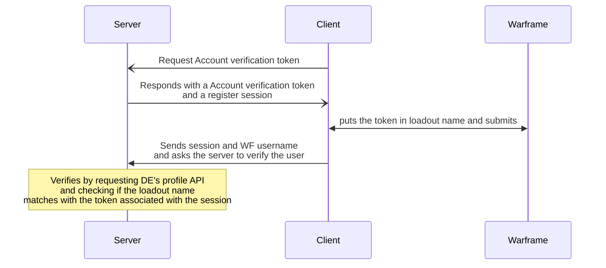

# Registration and how it works

A register-session is a session only used for registering.

## The process

## `register_sessions` table
| Column Name       | Data Type | Constraints |
| ----------------- | --------- | ----------- |
| id                | int       | PK          |
| created_at        | DATETIME  | NOT NULL    |
| updated_at        | DATETIME  |             |
| session_id        | UUID      | PK          |
| expiry            | DATETIME  | NOT NULL    |
| verification_code | STRING    | NOT NULL    |

